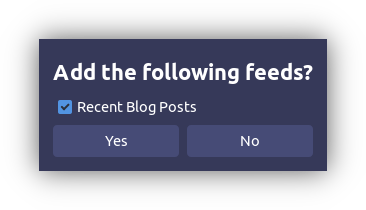
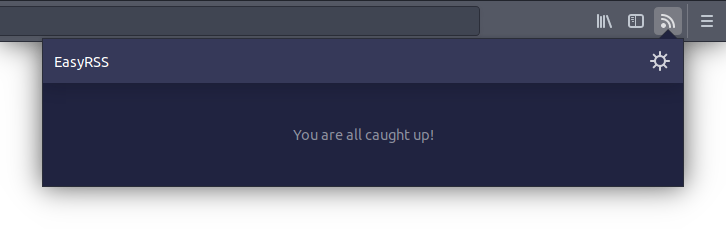
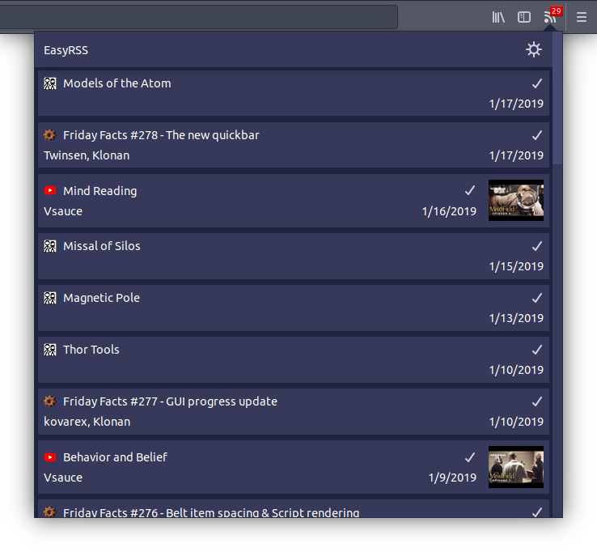
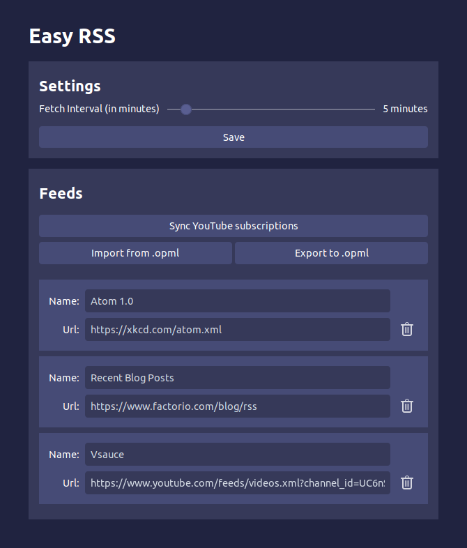

# Easy RSS

Are you an avid consumer of internet media? Are you frustrated by the lack of a
consistent way of getting notifications for the content that you love? If you
answer yes to any of these questions, then RSS feeds are the solution for you!

There is _one_ problem i didn't mention...

RSS feeds are an old technology straight from the 90s, and because of that most
RSS readers and managers look like they are from the same era.

That's why i made Easy RSS! The RSS manager for the common internet denizen!
This stylish and modern RSS manager takes all the simplicity of the RSS format,
and incorporates it into a modern and stylish design to create an easy to use
but still powerful piece of software.

Easy RSS includes features such as:

- Synchronizing your YouTube subscriptions, so you no longer have to worry
  about a spooky algorithm controlling what you see.
- Importing and exporting your feeds to and from other RSS readers, so you can
  easily adopt Easy RSS, or leave for another RSS reader if you feel like it
  (altough I shouldn't tell you that if I want a higher usercount).
- An simple and easy to understand modern UI that makes sure you are never lost
  in settings pages and Windows XP-esque dialogs

## Building

1. Make sure you have yarn installed
2. Run `yarn install`
3. Run `yarn dist`
4. Enjoy the compiled code in the `dist` folder and the extension .zip file in `web-ext-artifacts`!
5. ...
6. Profit!

## Screenshots

